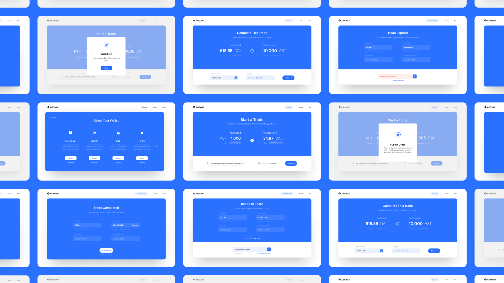

## AirSwap OTC

[AirSwap](https://www.airswap.io/) is a peer-to-peer trading network for Ethereum tokens. Peers connect based on common interest, agree on a price through mutual cryptographic signatures, and settle trades without intermediaries. [AirSwap OTC](https://trader.airswap.io/) is an open-source interface to perform over-the-counter (OTC) swaps with known counterparties.

## Resources

Website → [https://www.airswap.io/](https://www.airswap.io/)

About → [https://about.airswap.io/](https://about.airswap.io/)

Twitter → [https://twitter.com/airswap?lang=en](https://twitter.com/airswap)

Discord → [https://chat.airswap.io](http://chat.airswap.io)

## Run Locally

This repository uses .nvmrc to manage node version, so run `nvm install` before `yarn` to make sure you are running the correct node version.

### `yarn install`

Install dependencies required to run the app.

### `yarn start:dev` or `yarn start:prod`

Runs the app locally against development or production environment. Add a `network` query parameter corresponding to different [chainIds](https://github.com/airswap/airswap-protocols/blob/559f70277ba1c8c87a95a74089aa110b43bcd49c/tools/constants/index.ts#L30-L35) to access different networks.

### `yarn locale`

Re-generates locale messages.

## Important Notes

- `.babelrc` is used for `extract-react-intl-messages` only. The dev webpack
  babel config is loaded inside `config-overrides`, and the storybook babel
  config is loaded inside `.storybook/webpack.config.js`
- We're currently injecting extra babel plugins inside the react-scripts webpack
  configs instead of using babelrc to preserve the react-scripts additions
